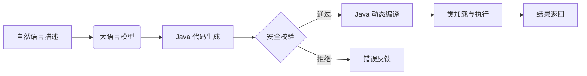

# NatJava :自然语言到Java代码的实验性桥梁
让编程如说话般自然，通过自然语言驱动的动态代码执行引擎实现。

## 🧪 项目愿景与定位

**NatJava** 是一个实验性开源项目，旨在探索自然语言描述与Java代码执行之间的桥梁技术。我们目前处于**早期探索阶段**，目标是：

> **逐步构建自然语言编程的可行路径**  
> 通过可验证的技术实验，探索AI生成代码与Java运行时集成的可行性，  
> 构建可扩展的原型系统，为未来自然语言编程提供技术基础。

**这不是一个生产就绪的解决方案**，而是一个开放的研究平台，邀请开发者共同探索这一前沿领域的技术挑战与可能性。

## 📌 当前阶段目标

### 阶段一：核心原型验证（当前阶段）
- [x] 建立基础项目结构
- [x] 实现动态编译与执行引擎
- [ ] 集成基础AI代码生成（DeepSeek）
- [ ] 构建最小可行安全沙箱
- [ ] 创建基础命令行界面

### 阶段二：能力扩展
- [ ] 增强代码生成质量
- [ ] 完善安全防护机制
- [ ] 添加参数支持
- [ ] 实现执行结果缓存

### 阶段三：应用探索
- [ ] 开发简单规则引擎用例
- [ ] 探索数据转换场景
- [ ] 构建教育演示案例

## 🛠️ 技术探索方向

我们正在探索以下技术组合的可行性：

### 当前技术挑战
1. **AI代码质量**：生成代码的可靠性、安全性和性能
2. **执行安全**：防止恶意或危险代码执行
3. **方法定位**：自动识别执行入口点
4. **上下文感知**：理解执行环境与需求

目前，这个项目对我个人来说不是在构建成品，而是在探索可能。欢迎大家一起交流。

📞 联系与讨论
项目主页: https://github.com/Chthingker/NatJava

个人联系: uutiych@outlook.com
