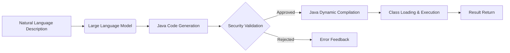

# NatJava: An Experimental Bridge from Natural Language to Java Code
Make programming as natural as speaking, with a dynamic code execution engine driven by natural language.  

#### **🔬 Project Vision & Positioning**  
**NatJava** is an experimental open-source project exploring bridge technologies between natural language descriptions and Java code execution. We are currently in the **early exploratory phase**, with the goal of:  

> **Gradually building a viable path for natural language programming**  
> Through verifiable technical experiments, exploring the feasibility of integrating AI-generated code with Java runtime,  
> constructing an extensible prototype system, and laying the technical foundation for future natural language programming.  

**This is not a production-ready solution**, but an open research platform inviting developers to jointly explore technical challenges and possibilities in this frontier field.  

#### **📌 Current Phase Goals**  
**Phase 1: Core Prototype Validation (Current Phase)**  
- [x] Establish foundational project structure  
- [x] Implement dynamic compilation and execution engine  
- [ ] Integrate basic AI code generation (DeepSeek)  
- [ ] Build minimal viable security sandbox  
- [ ] Create basic command-line interface  

**Phase 2: Capability Expansion**  
- [ ] Enhance code generation quality  
- [ ] Improve security mechanisms  
- [ ] Add parameter support  
- [ ] Implement execution result caching  

**Phase 3: Application Exploration**  
- [ ] Develop simple rule engine use cases  
- [ ] Explore data transformation scenarios  
- [ ] Build educational demonstration cases  

#### **🛠️ Technical Exploration Directions**  
We are exploring the feasibility of the following technical stack:  

#### **Current Technical Challenges**  
1. **AI Code Quality**: Reliability, safety, and performance of generated code  
2. **Execution Security**: Preventing malicious or dangerous code execution  
3. **Method Localization**: Automatically identifying execution entry points  
4. **Context Awareness**: Understanding execution environments and requirements  

> This project is currently not focused on building a finished product, but on exploring possibilities. Collaboration is welcome!  

**📞 Contact & Discussion**  
Project Homepage: https://github.com/Chthingker/NatJava  
Personal Contact: uutiych@outlook.com  

